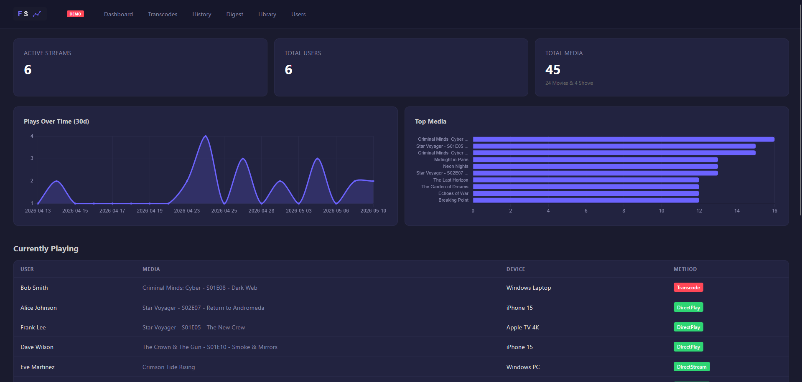
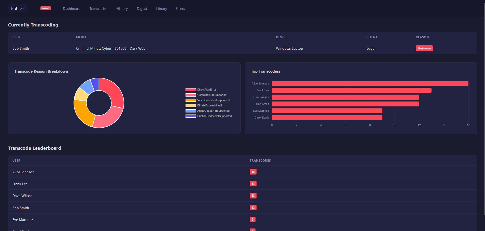
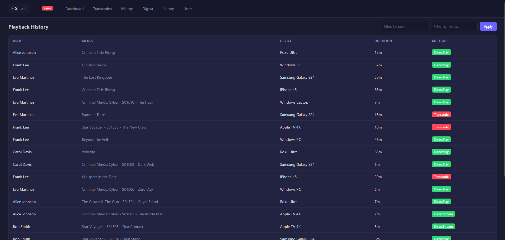
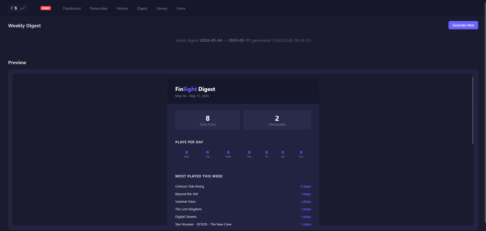
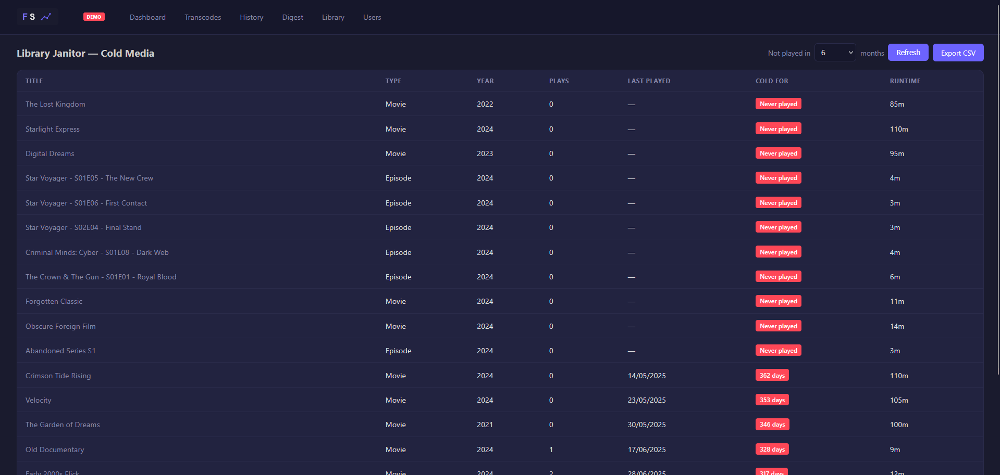
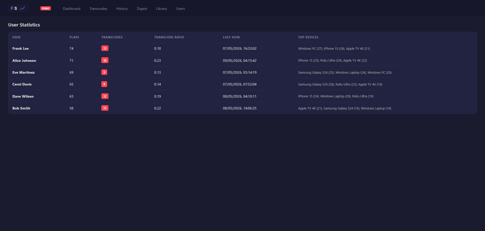

<div align="center">
  
  <h1>FinSight v1.0.0</h1>
  <p><strong>Open-source monitoring and statistics dashboard for Jellyfin</strong></p>
  <p>Inspired by Tautulli &middot; Built with FastAPI + Chart.js + SQLite</p>
</div>

---

FinSight is a lightweight sidecar application that connects to your Jellyfin server via its API to provide real-time monitoring, historical playback analytics, transcode visibility, library management tools, and weekly email digests &mdash; all in a single Docker container.

## Screenshots

| | |
|---|---|
|  |  |
|  |  |
|  |  |

---

## Features

- **Live Dashboard** &mdash; Active streams, plays-over-time chart, top media, recent activity
- **Transcode Shaming** &mdash; See who is transcoding, why, and from which device
- **Playback History** &mdash; Filterable, paginated log with user/media search
- **Media Detail** &mdash; Per-item play count, transcode ratio, and full play history
- **Library Janitor** &mdash; Identify cold media not played in N months, with CSV export
- **User Stats** &mdash; Per-user play counts, transcode ratio, device breakdown
- **Weekly Digest** &mdash; Auto-generated email-ready HTML with top media, users, genre breakdown
- **Prometheus Metrics** &mdash; `/api/metrics` endpoint for Grafana integration
- **Polling-first** &mdash; Works out of the box without Jellyfin Webhook plugin

## Quick Start

### Demo (no Jellyfin required)

```bash
docker compose -f docker-compose.demo.yml up -d
```

Open `http://localhost:8500` &mdash; the app comes pre-loaded with 6 users, 45 media items, 400 playback sessions, and a sample weekly digest.

### Docker (with real Jellyfin)

FinSight uses **host networking** (`network_mode: host`) so the container can reach Jellyfin via `localhost` — ideal for running FinSight alongside Jellyfin on the same machine (Pi, server, etc.).

For first-time use, you'll need a `.env` file at the project root. If you're on the same machine as Jellyfin, you can omit `JELLYFIN_URL` — it defaults to `http://localhost:8096`:

```bash
git clone https://github.com/davtheconquerer/finsight.git
cd finsight
echo JELLYFIN_API_KEY=your-api-key-here >> .env
docker compose up -d
```

If your Jellyfin uses a different port or is on another machine:

```bash
echo JELLYFIN_URL=http://your-jellyfin-server:8096 >> .env
```

Open `http://<your-server>:8500`.

> **About host networking:** Host mode binds port 8500 directly to the server's network stack — no port mapping needed. This is the simplest setup for Linux deployments (Pi, VPS, dedicated server).  
> If you're using **Docker Desktop** (macOS/Windows) where host networking is limited, or want standard bridge networking, remove `network_mode: host` from `docker-compose.yml` and uncomment `ports:` — then use your server's LAN IP for `JELLYFIN_URL`.

### Manual

The app reads settings from environment variables or a `.env` file in the **working directory** — when running from `backend/`, place your `.env` in `backend/`.

**Option A — Environment variables (PowerShell):**

```powershell
cd backend
pip install -r requirements.txt

# Demo mode (no Jellyfin needed)
$env:DEMO_MODE="true"
python seed_demo.py
uvicorn app.main:app --host 0.0.0.0 --port 8500 --reload

# Production mode (with real Jellyfin)
$env:JELLYFIN_URL="http://localhost:8096"
$env:JELLYFIN_API_KEY="your-api-key-here"
uvicorn app.main:app --host 0.0.0.0 --port 8500 --reload
```

**Option B — `.env` file (any platform):**

Create `backend/.env`:

```
JELLYFIN_URL=http://localhost:8096
JELLYFIN_API_KEY=your-api-key-here
DEMO_MODE=false
POLL_INTERVAL=30
COLD_MEDIA_MONTHS=6
LOG_LEVEL=INFO
```

Then run:

```bash
cd backend
pip install -r requirements.txt
python seed_demo.py    # skip if connecting to real Jellyfin
uvicorn app.main:app --host 0.0.0.0 --port 8500 --reload
```

The `.env` is auto-loaded by `pydantic-settings` from the current working directory (`backend/`).

## Configuration

All settings are passed via environment variables or a `.env` file.

| Variable | Default | Description |
|---|---|---|
| `JELLYFIN_URL` | `http://localhost:8096` | Jellyfin server address |
| `JELLYFIN_API_KEY` | — | API key from Jellyfin Dashboard &rarr; API Keys |
| `POLL_INTERVAL` | `30` | Seconds between session polls (user/library poll less frequently) |
| `COLD_MEDIA_MONTHS` | `6` | Months of inactivity to flag media as cold |
| `LOG_LEVEL` | `INFO` | Logging verbosity |

## Pages

| Route | Description |
|---|---|
| `/` | Dashboard &mdash; stats, charts, active streams, recent history |
| `/transcodes` | Transcode shaming &mdash; live active transcodes, reason breakdown, leaderboard |
| `/history` | Playback history &mdash; filterable and paginated |
| `/media/{id}` | Media detail &mdash; stats and full play history |
| `/newsletter` | Weekly digest &mdash; preview and manual generation |
| `/library` | Library janitor &mdash; cold media scanner with CSV export |
| `/users` | User statistics &mdash; plays, transcodes, devices |

## API Endpoints

```
GET  /api/health
GET  /api/metrics                     # Prometheus format
GET  /api/sessions/active             # Live streams
GET  /api/sessions/history            # Paginated playback log
GET  /api/stats/overview              # Total counts
GET  /api/stats/plays-over-time       # 30-day timeline
GET  /api/stats/top-media             # Most played
GET  /api/stats/transcode-breakdown   # Transcode analysis
GET  /api/media/{id}                  # Media detail + history
GET  /api/library/cold-media          # Cold media list
GET  /api/library/cold-media/export   # CSV download
GET  /api/users/stats                 # Per-user breakdown
POST /newsletter/generate             # Trigger digest
GET  /newsletter/preview              # Latest digest HTML
```

## How It Works

```
Jellyfin API  ──>  Watchdog (polling loop)
                       │
                       ├──> Users table
                       ├──> MediaMetadata table
                       └──> PlaybackSession table
                                │
                    FastAPI ────┤
                       │        │
                  Jinja2 + Chart.js  ──>  Browser
                       │
              Newsletter Scheduler
              Library Janitor (on-demand)
```

The watchdog polls Jellyfin's `/Sessions` every N seconds, `/Users` every 10N seconds, and `/Items` (library) every 60N seconds. Data is upserted into SQLite. The web frontend queries the same database via FastAPI endpoints with Chart.js for visualizations.

## Roadmap

- **Webhook Consumer** &mdash; Process Jellyfin webhook events for real-time updates
- **File Size Tracking** &mdash; Poll `MediaSources` for per-item disk usage
- **Authentication** &mdash; Simple login for multi-user access
- **Notifications** &mdash; Email/Slack/Discord alerts for transcode events
- **i18n** &mdash; Multi-language support

## Testing

Tests are located in `backend/tests/`:

```bash
cd backend
py -m pytest tests/ -v
```

**50 passing tests** covering:
- JellyfinClient service (8 tests)
- NewsletterGenerator service (3 tests)
- LibraryJanitor service (5 tests)
- Integration API endpoints (7 tests)
- Router endpoints (24 tests — janitor, media, newsletter, sessions + 3 new v1.0 tests)

## Tech Stack

- **Backend:** Python 3.11+, FastAPI, SQLAlchemy (async), httpx
- **Frontend:** Jinja2, Chart.js 4.x, vanilla JS
- **Database:** SQLite via aiosqlite
- **Infrastructure:** Docker, Docker Compose

## License

MIT
